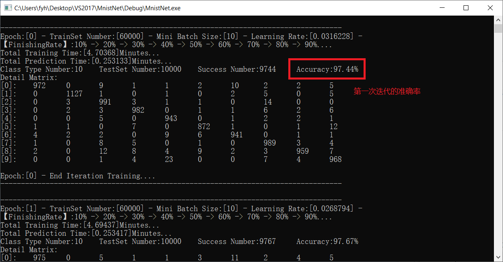
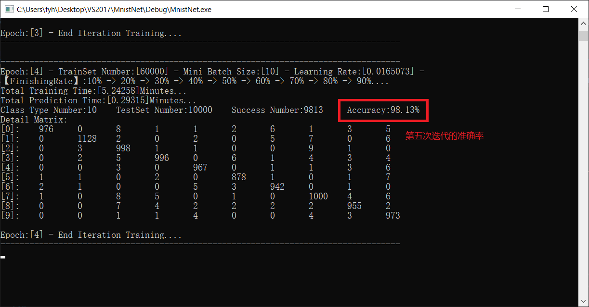

# MnistNet
1.我的第一个卷积神经网络，Mnist数据集的准确率达到98%

# 待修改
1.很多地方硬编码了,应该修改为参数传递的方式让代码更加灵活。
2.使用的是Mini-Batch Gradient Descent算法，所以可以将代码修改为多线程，提升训练速度。
3.使用类，将优化算法，损失函数，激励函数，进度显示...等一系列操作分开
.......

# 效果图
<h1 align="center">
	
	
</h1>
